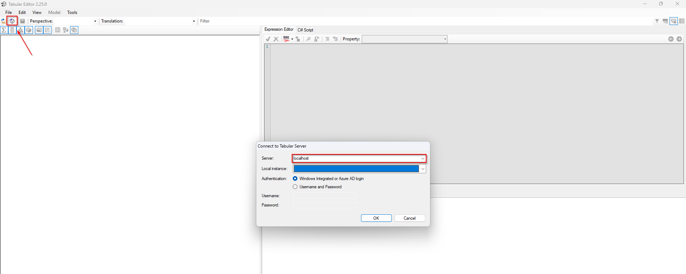
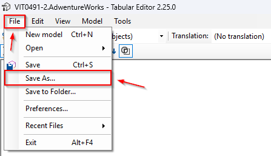
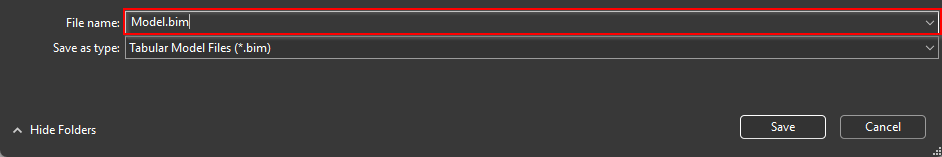

# Power BI utils

The purpose of this repository is to provide developers with tools and utilities to implement solutions on Power BI.

## 🚀 Getting Started

This repository contains automated scripts for Power BI workflows. Choose the script that best fits your use case and follow the instructions provided in each section.

## Contents

### 📁 [doc](https://github.com/javendia/Fabric/blob/main/doc)

Full documentation about the Power BI projects.

### 📁 [tabular](https://github.com/javendia/Fabric/blob/main/tabular)

Scripts to automate actions over a tabular model

- 🔗 **[tabular/BimToPBIP.csx](https://github.com/javendia/Fabric/blob/main/tabular/BimToPBIP.csx)**
    - **Description**
        
        Script to convert an on-premises Microsoft SQL Server Analysis Services tabular model to a Power BI project (.pbip)
    - **Prerequisites**
        
        - [Tabular Editor 2.x](https://github.com/TabularEditor/TabularEditor/releases)
        - An empty Power BI project (.pbip)
        - A dictionary, which assigns the data source (table or view) for each entity model
    - **How it works**
        
        - The first step is to extract the metadata from the tabular model. We can get it using Tabular Editor as follows:
          
            1. Connect with the desired tabular model
            
               <p align="center">
                 
               </p>
            
            2. Save metadata
            
               <p align="center">
                 
               </p>
               <p align="center">
                 
               </p>
            
        - Secondly, we need to fill a dictionary CSV file, where each key-value represents an entity model and its data source (table or view)
        - Then, we will open the extracted tabular model and finally run the script on Tabular Editor. The script prompts you for three values:
            - The SQL connection string to the lakehouse SQL endpoint, used as destination server
            - Lakehouse name, used as destination database
            - The path to the dictionary
    - **Limitations**
        
        - The compatibility level must be higher or equal than 1500
        - It is planned to work with a single SQL data source
        - The script transforms default partitions. Custom partitions must be migrated manually

### 📁 [pbi](https://github.com/javendia/Fabric/blob/main/pbi)

Scripts to perform actions over Power BI reports

- 🔗 **[pbi/MigratePBI.ps1](https://github.com/javendia/Fabric/blob/main/pbi/MigratePBI.ps1)**
    - **Description**
        
        Script to convert a Power BI report (.pbix) to a Power BI project (.pbip) and publish it to the service.
    - **Prerequisites**
        
        - [PowerShell 7.x](https://learn.microsoft.com/en-us/powershell/scripting/install/installing-powershell-on-windows?view=powershell-7.5)
        - Permission to execute PowerShell scripts

        ```powershell
        Set-ExecutionPolicy -ExecutionPolicy RemoteSigned -Scope CurrentUser
        ```
    - **How it works**
        
        - Firstly, the script requests some data to the user:
            - The path to Power BI files to convert
            - Destination workspace name
            - In order to bind the report, the corresponding semantic model id
        - During the execution, the script creates a subfolder in the directory passed as argument. After that, you must save the report as Power BI project manually. The project must be placed in the subfolder created previously
        - Finally, the report is published to Power BI service and it is linked to the semantic model

## 📄 License

This project is licensed under the MIT License - see the LICENSE file for details.
